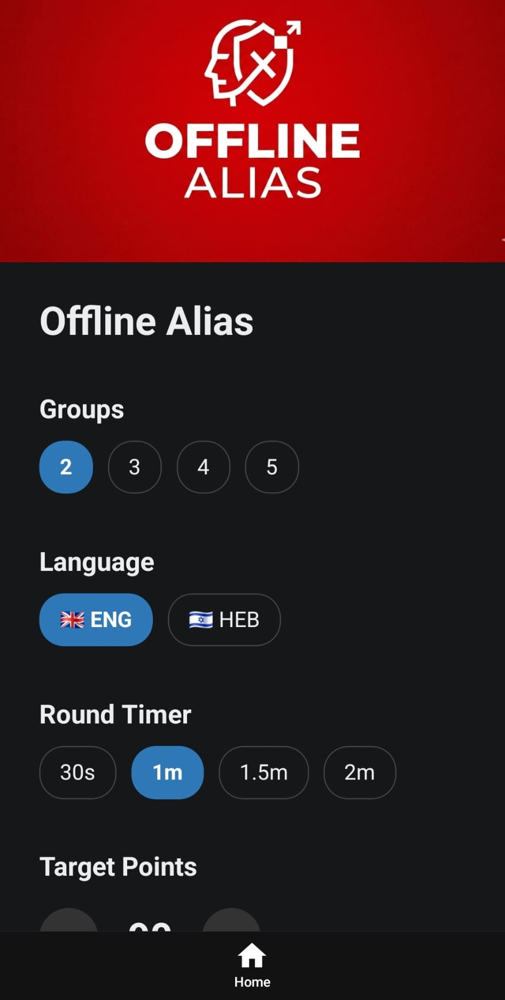
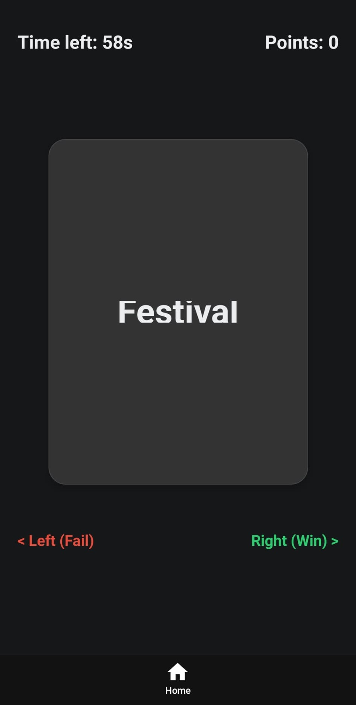

# Welcome to Offline Alias Game 👋

Offline Alias Game

## Get started

1. Install dependencies

   ```bash
   npm install
   ```

2. Start the app

   ```bash
   npx expo start
   ```

## Game Rules

1. The game is played in rounds.
2. In each round, players take turns guessing words.
3. Each word is worth 1 point.
4. Skip word - lose 1 point.
5. The group to reach the target score wins.

## Word Banks

1. English
2. Hebrew

## Game Images

<p float="left">
  
  
</p>

